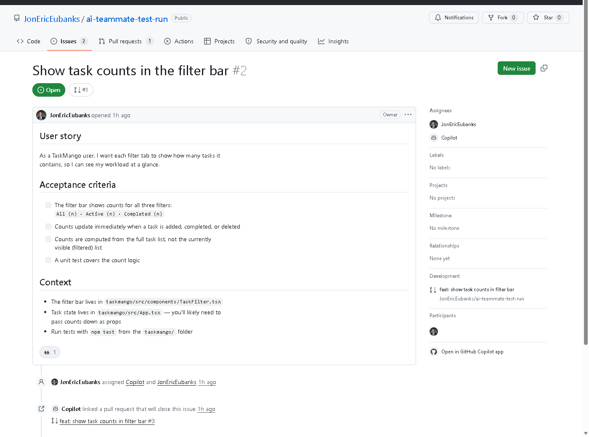
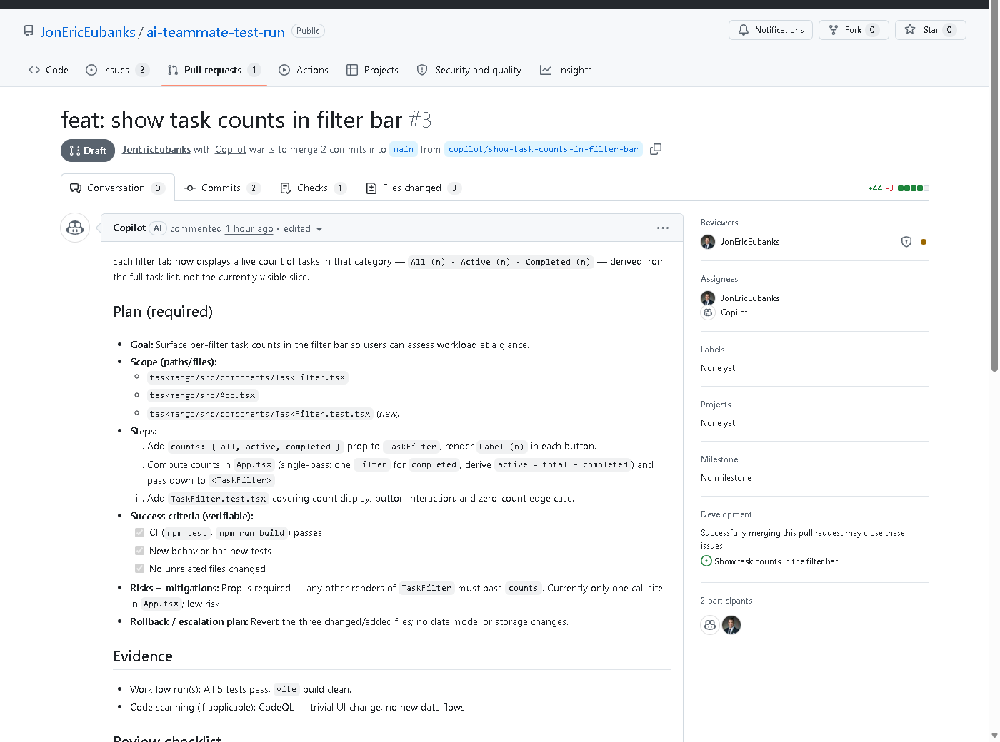



# AI Teammate 101
### Delegate Like a Tech Lead

  

**You already know how to code. This workshop teaches you how to _delegate_.**

A self-paced, hands-on workshop that teaches you to work with **GitHub Copilot's Coding Agent** —
the autonomous AI developer that takes a GitHub issue and returns a pull request.

 

### Start in 60 seconds

**One click — the repo name, description, and public visibility are pre-filled. Just hit _Create repository_, then open Module 00.**

~2.5 hours &nbsp;|&nbsp; Auto-graded certificate &nbsp;|&nbsp; 100% on GitHub.com — nothing to install

 

<a href="#quick-start">Quick Start</a> &nbsp;·&nbsp;
<a href="#what-youll-walk-away-with">Outcomes</a> &nbsp;·&nbsp;
<a href="#module-map">Modules</a> &nbsp;·&nbsp;
<a href="#how-to-take-this-workshop">How It Works</a> &nbsp;·&nbsp;
<a href="#prerequisites">Prerequisites</a> &nbsp;·&nbsp;
<a href="#faq">FAQ</a>

---

## The loop you'll master

  

<b>Issue &rarr; Agent &rarr; PR &rarr; Review &rarr; Merge.</b> Six times. By the end, it's muscle memory.

---

## See it in action

  
  

<i>You write the issue. Copilot writes the code. You review the PR.</i>

---

## What you'll walk away with

| | |
|---|---|
| **A tech-lead skill** | Write issues so clear an AI can implement them, and review AI code with a professional's eye |
| **Security reflexes** | Watch CodeQL + Copilot Autofix find and fix a real vulnerability in your repo |
| **A custom agent** | Build a specialist agent tuned to your workflow, then orchestrate several at once |
| **A certificate** | Hit 6/6 milestones and the examiner bot awards a shareable **Certified AI Tech Lead** certificate — right inside your own repo |
| **GH-600 alignment** | Every module maps to a domain of Microsoft's _Agentic AI Developer_ certification — [see the map](GH600-MAP.md) |

---

## What makes this workshop different

Most AI tutorials show you a chat window. This one puts you in the **tech lead's chair**:

- **Auto-graded.** A built-in examiner bot watches your repo and checks off milestones as you delegate, review, merge, and secure.
- **Real engineering gates.** TaskMango ships with CI, a PR plan-gate, CODEOWNERS routing, and least-privilege workflows — because reviewing AI code _is_ the skill.
- **A sample app with personality.** TaskMango has planted bugs, a real (harmless) XSS vulnerability, and one easter egg. Complete every task and… you'll see.

<b>Why this workshop exists</b> — the 30-second version

 

Autocomplete was step one. Chat was step two. But the biggest productivity shift in AI-assisted development is learning to **hand off whole tasks** — writing issues so clear an AI can implement them, reviewing AI-generated code with a critical eye, and letting an agent fix its own security bugs.

That's a tech-lead skill. This workshop gives it to you in ~2.5 hours, using nothing but your own GitHub account and your own Copilot license.

<b>What you'll build</b> — meet TaskMango

 

You'll copy this template, then spend the workshop acting as the tech lead of **TaskMango** — a delightfully mediocre task-tracker app with real bugs, thin tests, and a genuine security vulnerability. Your job isn't to fix it. Your job is to _get Copilot to fix it_ — and to review its work like a professional.

---

## How to take this workshop

> **Skim first, click second.** Here's the whole flow before you touch anything:

1. Click the **Copy Exercise** button at the top of this page. It opens GitHub's new-repo page with everything pre-filled: the name (`my-ai-teammate-workshop`), the description, and **public** visibility — public matters because code scanning is free on public repos, and you'll need it in Module 04.

<b>🤷 Prefer to do it manually?</b>

 

1. Click **Use this template &rarr; Create a new repository** (button at the top of this page).
2. Name it **`my-ai-teammate-workshop`**.
3. For **Description**, copy-paste:
   > _My AI Teammate 101 workshop — hands-on practice delegating tasks to GitHub Copilot's coding agent, reviewing its PRs, and earning my Certified AI Tech Lead certificate._
4. Make it **public**.

2. Hit the green **Create repository** button.
3. **Turn your copy into a website** (60 seconds): go to **Settings &rarr; Pages &rarr; Deploy from a branch &rarr; `main` / `(root)` &rarr; Save**. Then open `https://<your-username>.github.io/my-ai-teammate-workshop/` — this is how you'll read the workshop.

<b>📹 Walkthrough: Pages to Publish</b>

 

7. Open **[Module 00](setup/00-environment.md)**. Work through the modules in order. Each ends with a **checkpoint**, and the **progress bot** tracks your milestones automatically in your copy's Issues.
8. Everything happens in _your copy_ of this repo. Break things freely — that's the point.
9. Finish all 6 milestones → **certificate unlocked**. Merge the certificate PR and you're done.

<b>Prefer a browser-based setup?</b> Open it in GitHub Codespaces instead

 

---

## Module map

| # | Module | Time | You'll learn to… |
|---|--------|------|------------------|
| 00 | [Environment setup](setup/00-environment.md) | 15 min | Get your repo, license, and tooling ready |
| 01 | [Meet Your AI Teammate](modules/01-meet-your-ai-teammate/README.md) | 15 min | Understand what Coding Agent is (and isn't) |
| 02 | [Delegate Your First Task](modules/02-delegate-a-task/README.md) | 30 min | Run the full loop: issue &rarr; agent &rarr; PR &rarr; merge |
| 03 | [Be the Tech Lead](modules/03-become-the-tech-lead/README.md) | 30 min | Delegate in parallel & review AI code with a rubric |
| 04 | [Security on Autopilot](modules/04-security-on-autopilot/README.md) | 25 min | Use CodeQL + Copilot Autofix on a real vulnerability |
| 05 | [Build a Specialist Agent](modules/05-customize-your-agent/README.md) | 25 min | Create a custom agent tuned to your workflow |
| ★ | [Capstone](capstone/README.md) | 45 min | Ship two delegated tasks end-to-end, solo |
| → | [AI Architect 201 *(coming soon)*](https://github.com/JonEricEubanks/ai-architect-201) | Course 2 | Multi-agent orchestration, MCP servers, governance |

---

## Prerequisites

- A GitHub account
- A Copilot plan that includes the coding agent — Pro, Pro+, Business, or Enterprise (**free for verified students** via [GitHub Education](https://education.github.com)). On the Free plan? See the [setup fallback](setup/00-environment.md).
- That's it. No local install — everything happens on GitHub.com.

---

## FAQ

<b>Do I need to install anything?</b>

 

No. Everything happens on GitHub.com — issues, PRs, code review, code scanning, and the certificate. If you prefer a full IDE, open your copy in GitHub Codespaces.

<b>What if I'm on the Copilot Free plan?</b>

 

The coding agent requires Pro, Pro+, Business, or Enterprise. If you're on Free, see the [setup fallback](setup/00-environment.md) for alternatives.

<b>Can I use this for a class or team workshop?</b>

 

Yes — the content is [CC BY 4.0](https://creativecommons.org/licenses/by/4.0/). Fork it, teach with it, just attribute. The auto-grader works out of the box for any number of students.

<b>How does the certificate work?</b>

 

A GitHub Actions workflow watches your repo for milestone events (issue assigned, PR merged, security fix, etc.). Hit 6/6 and it opens a PR adding your certificate to the repo. Merge it and you're done.

---

## License

**Code** (including TaskMango): [MIT](LICENSE) &nbsp;·&nbsp; **Workshop content**: [CC BY 4.0](https://creativecommons.org/licenses/by/4.0/) — teach with it, just attribute.

## Contributing

Found friction? Ran it with a class? Open an issue or PR — 
and yes, assigning the issue to Copilot is an acceptable (_encouraged_) way to do it.

 

**Star this repo if it helped you delegate like a tech lead.**

